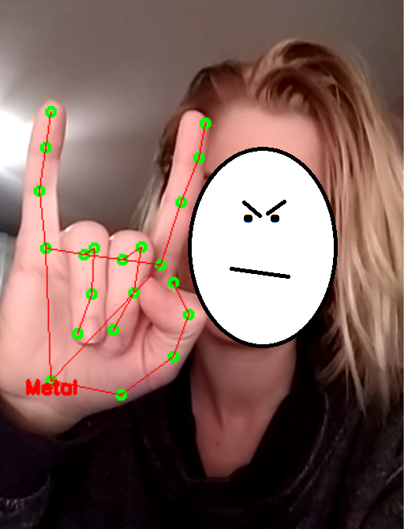
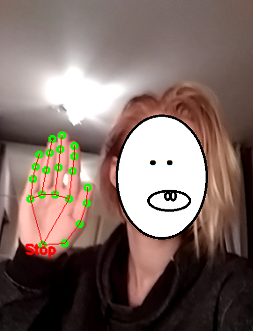
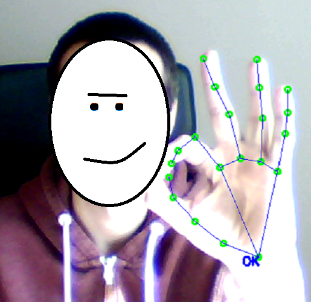
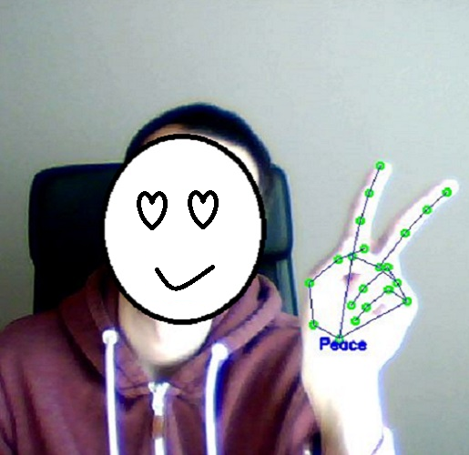

# Hand gesture recognition

I found many hand gesture recognition repo on Github but most model was horribly overfitted so I decided to make my own. [Google MediaPipe](https://github.com/google/mediapipe) models provide the hand and hand keypoint detection. My hand gesture detector uses the keypoint coordinates to guess the intended sign.

 

 
